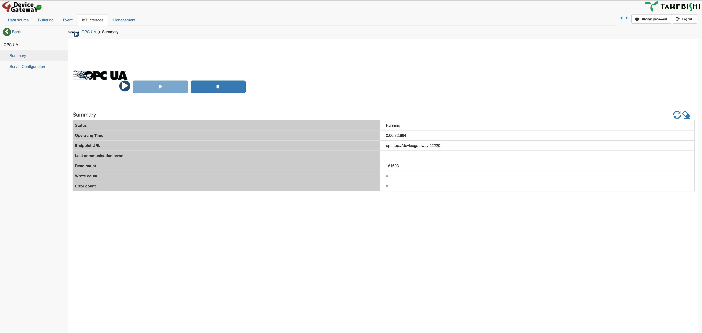
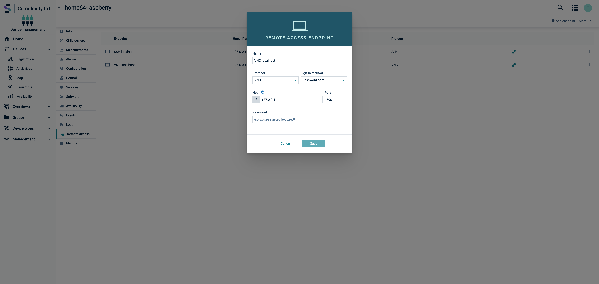

# Installation Manual

## Overview

> [!NOTE]
> We can use Takebishi DeviceGateway & thin-edge.io either in combination with the Cumulocity IoT OPC-UA gateway or directly with the thin-edge (via MQTT).
> The second option is more lightweight but requires a little bit knowledge of the thin-edge.io MQTT data model (https://thin-edge.github.io/thin-edge.io/understand/thin-edge-json/).

## Prerequisites

- A tenant in Cumulocity IoT with OPC-UA feature enabled
- A license for Takebishi DeviceGateway
- docker and docker compose installed

## Installation

### Setup 
1. Follow the instructions to [install](https://thin-edge.github.io/thin-edge.io/install/) thin-edge and [connect](https://thin-edge.github.io/thin-edge.io/start/connect-c8y/) it to our Cumulocity IoT account
2. Copy the ```opcua``` folder (or the ```thin-edge_only``` folder in case of not using OPC-UA) of this repository onto our thin-edge device (or clone the whole repository).
3. Create the following folders on our thin-edge device
   ```console
   sudo mkdir /etc/opcua
   sudo mkdir /etc/takebishi
   sudo mkdir /etc/takebishi/sd_card
   sudo mkdir /etc/takebishi/data
   ```
4. Copy our Takebishi license file into the folder ```/etc/takebishi/sd_card```
5. Adjust the ```.env``` file to our liking. The OPCUA_GATEWAY_IDENTIFIER needs to be unique within our Cumulocity IoT tenant
6. Start the docker from within the opcua (or thin-edge_only) folder
    ```console
    sudo docker compose up
    ```
    The images for the Cumulocity IoT OPC-UA gateway and for Takebishi DeviceGateway should be pulled automatically. Otherwise please check the FAQ ([Cumulocity IoT OPC-UA Gateway](#where-can-i-find-the-docker-image-for-cumulocity-iot-opc-ua-gateway?)
    & [Takebishi DeviceGateway](#where-can-i-find-the-docker-image-for-takebishi-devicegateway?))

### Configuration DeviceGateway
Once the containers have started we can access the DeviceGateway GUI on localhost:80.
We can log in with the default user (username: administrator / password: admin)


First we should verify that the license file was correctly recognized. For that we can navigate to Management->Information->Version and check the ```Serial```


> [!NOTE]
> The remaining steps are only needed if using OPC-UA

As the final step we have to activate the OPC-UA server within DeviceGateway. For that we can navigate to IoT Interface->OPC UA->Server Configuration and set the OPC-UA server to valid. For the rest of this guide we will assume we use the default configuration.


Finally we can start the server from the summary page.



### Configuration Cumulocity IoT

> [!NOTE]
> This can be skiped in case of not using OPC-UA

At this point in Cumulocity IoT Devicemanagement we should see two device objects
1. The thin-edge device
2. The OPC-UA gateway

Navigating to the gateway object in the next step we will connect to the OPC-UA server running within Takebishi DeviceGateway.
For that go to the ```OPC UA Server``` screen on the gateway device and add a new server.
As the ```Server URL``` we have to enter ```opc.tcp://takebishi-device-gateway:52220``` (not the URL that might be shown in the DeviceGateway GUI)


Afterwards we should see a new device added in Cumulocity IoT (as a child device of the gateway).
We can navigate to the device and see the OPC-UA address space (it might take a couple of minutes until the gateway has scanned and synced the address space to the cloud).


Once we are adding data sources in the DeviceGateway they will automatically show up in the OPC-UA address space under Root->Objects->DataSource

### Sending data

Here are two examples utilizing the simulation features within Takebishi DeviceGateway to send data to Cumulocity.

[Example with OPC-UA](/docs/example_opc_ua.md)

[Example with MQTT](/docs/example_mqtt.md)

## Optional features

### Managing the Takebishi license file through Cumulocity IoT

> [!NOTE]
> This section only applies if we are using a temporary trial license file. If we are using a commercial license, the license management works via Takebishi's license server. See the FAQ [How do I get a DeviceGateway license?](#how-do-i-get-a-license-for-takebishi-devicegateway?)

We can manage (and replace) the Takebishi license file as a configuration through Cumulocity IoT. For that first go to the thin-edge configuration for the configuration plugin under ```/etc/tedge/plugins/tedge-configuration-plugin.toml```
In this file add the row ```{ path = '/etc/takebishi/sd_card/DeviceGateway.lic', type = 'device-gateway.lic' },```

After a restart of the thin-edge the new configuration file should appear in the Cumulocity IoT UI.


### Accessing the Takebishi GUI through VNC via Cumulocity IoT Cloud Remote Access

> [!NOTE] 
> For this manual we will utilize TigerVNC. Cumulocity IoT Cloud Remote Access has also been tested with other VNC servers. If we use another VNC server the setup might be slightly different.

> [!IMPORTANT] 
> Please ensure that our Cumulocity IoT tenant has the microservice "Cloud-remote-access" subscribed.

First we install TigerVNC onto the device:
```sudo apt install tigervnc-standalone-server```

After installation we will need to set a VNC password
```tigervncpasswd```

In order to have TigerVNC starting on system boot we will create a systemd entry.
Under ```/etc/systemd/system``` create a file ```tigervnc.service``` with the following content. We can exchange ```mysuer``` with the user we want to let the service run under.

```
[Unit]
Description=Remote desktop service (VNC)
After=syslog.target network.target

[Service]
Type=simple
User=myuser
PAMName=myuser
PIDFile=/home/myuser/.vnc/%H%i.pid
ExecStart=/usr/bin/tigervncserver -fg :1
ExecStop=/usr/bin/tigervncserver -kill%i

[Install]
WantedBy=multi-user.target
```

Afterwards we start the service
```sudo systemctl start tigervnc```

In Cumulocity IoT we will go to our thin-edge device in the Devicemanagement to the Remote Access screen. Here we now can add a new endpoint. With the above service configuration the port to configure is 5901.



## FAQ

### How do I get a license for Takebishi DeviceGateway?

If you need a temporary trial license please get in contact with Takebishi or the Software AG partner team.
Commercial licenses can be acquired from the Takebishi web store https://www.faweb.net/en/support/order-online/#dgw
In case of commercial licenses you will need to install the license management server from Takebishi (which is available as docker as well https://www.faweb.net/en/download/download).

### Where can I find the docker image for Takebishi DeviceGateway?

The download of the docker image can be either found under https://www.faweb.net/en/download/download/#devicegateway or in the AWS docker repository under https://gallery.ecr.aws/takebishi/tkbs-dgwd20
```console
docker pull public.ecr.aws/takebishi/tkbs-dgwd20:<version>
```

### Where can I find the docker image for Cumulocity IoT OPC-UA Gateway?

The download of the docker image can be found under https://github.com/thin-edge/opcua-device-gateway-container/pkgs/container/opcua-device-gateway
```console
docker pull ghcr.io/thin-edge/opcua-device-gateway:<version>
```