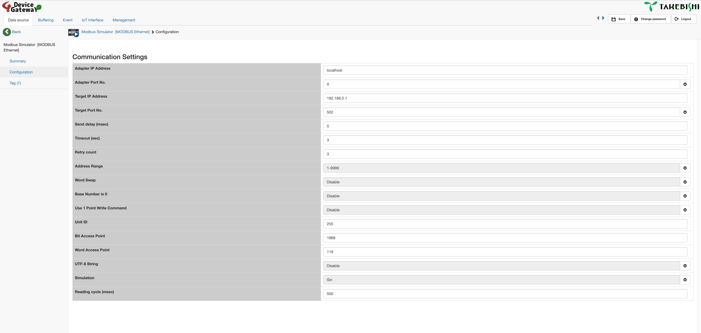
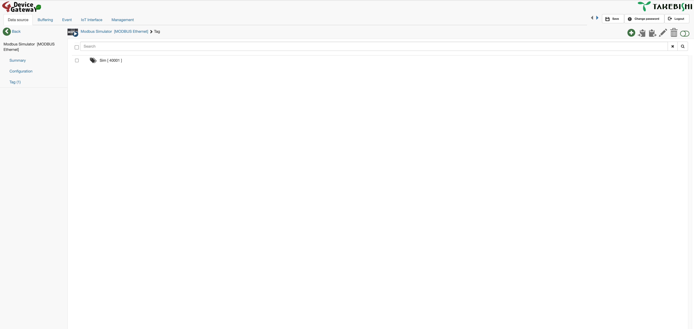
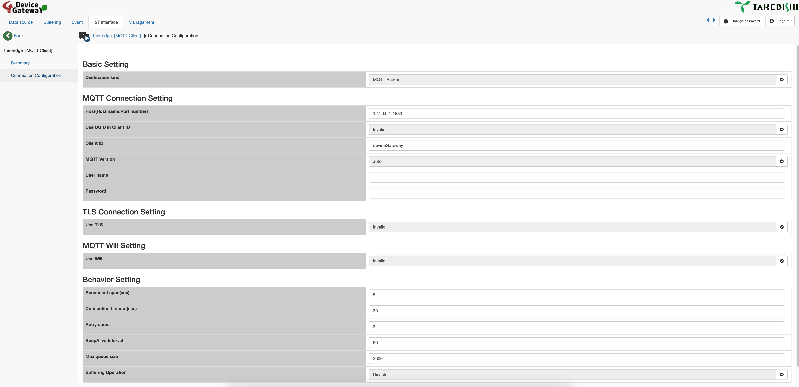
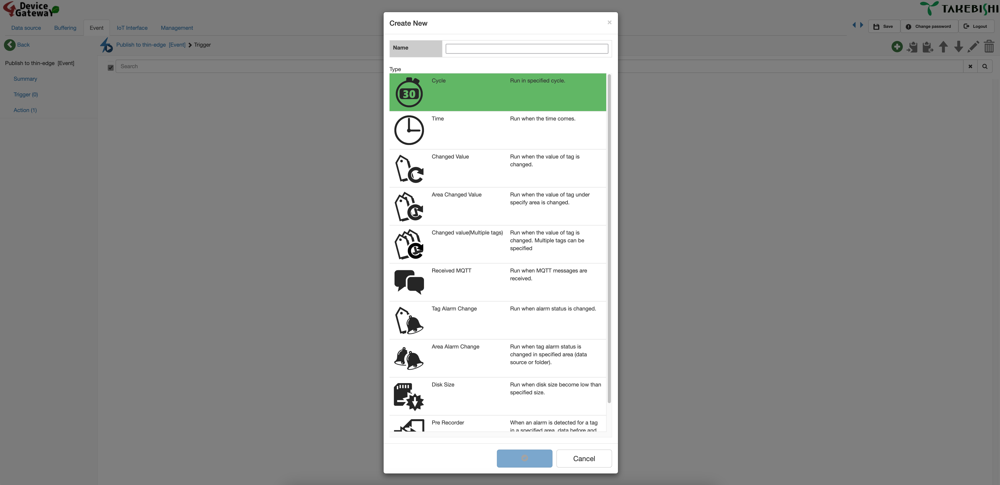
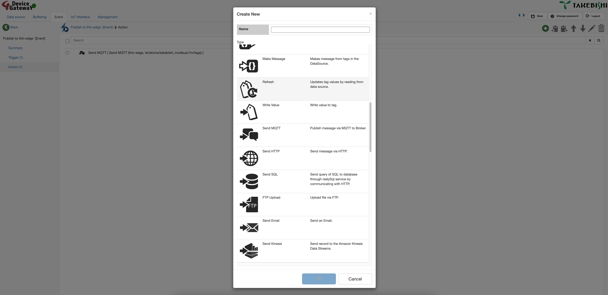
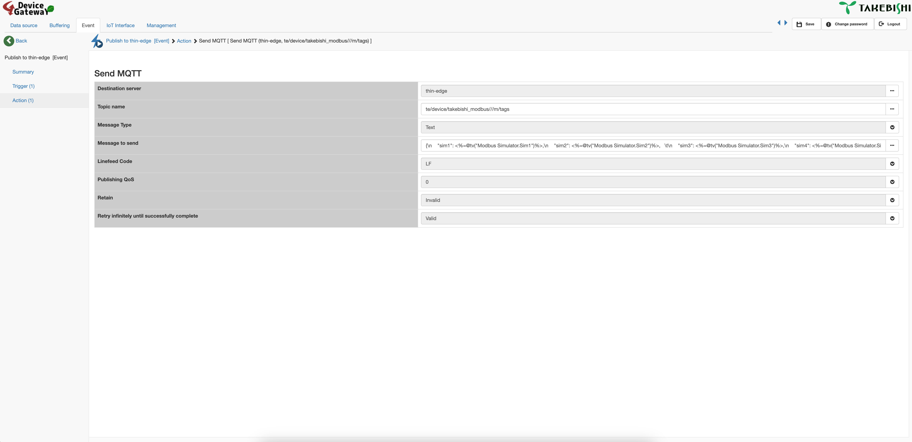
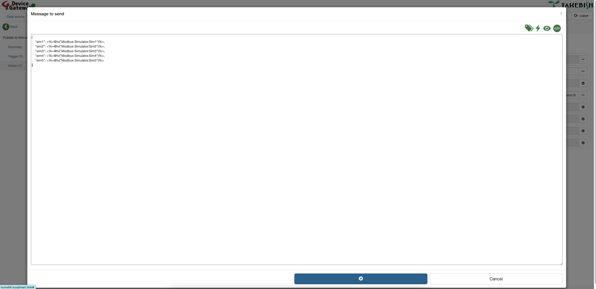

# Testing the setup E2E with MQTT

## Introduction

This short guide will show how we can test the complete setup without the need of any additional hardware or device.
We will utilize the Modbus simulator within the Takebishi DeviceGateway to generate data and map it correctly to Cumulocity IoT.

## Setting up the Modbus simulator

In the Takebishi DeviceGateway GUI got to ```Data Source```, click the big plus button, find the ```MODBUS Ethernet``` adapter, give it a name and confim.

Afterwards we can enter the configuration of the adapter by clicking the smal cog wheel.

Under the configuration menu find the ```Simulation``` entry and change it from None to the type of simulation we want (we will use sinus for now).



Afterwards go to the ```Tag``` entry.

For this example we will only create a single entry, but feel free to create as many as we want.

Click the green plus icon in the top right, select tag and give it a name. By default it will be created as holding register and gets the address 1 which is fine for the purpose of this example.



In the end do not forget to start the adapter by pressing the play button.

## Configuring MQTT sending

First we need to setup a new MQTT client within Takebishi DeviceGateway. For that under ```IoT Interface``` we can add a new MQTT client.

After creation we go into the connection configuration and set the ```Host``` to ```127.0.0.1:1883``` and set a Client ID. All other configuration is optional.



Afterwards we need to save the configuration and start the MQTT client.

Now we can configure the MQTT sending.

For that we go to ```Event``` and create a new Event. Once created we go into the configuration and configure a trigger.

For this example we will just use a cyclic sending every 10 seconds.



As the last step we can now set an action which should be executed when the trigger happens. For that we go to ```Action``` and add a new action. We will use the ```Send MQTT``` action for this example.



In the configuration of this action we need to set the correct topic and payload so that the thin-edge can read it. Please check the thin-edge.io documentation and ensure we understand the topic and payload structures of thin-edge (https://thin-edge.github.io/thin-edge.io/understand/thin-edge-json/).

For the topic it is best to utilize child devices. If we connect multiple PLCs to Takebishi DeviceGateway it is recommended to have different Events that send MQTT messages to different topics so that each PLC will show up in Cumulocity as an own Child Device. Depending on our use case it might be even worth to split the data even more, if one PLC represents multiple machines.



In order to configure the payload we click on the 3 buttons on the right for ```Message to send```. We will need to enter the proper MQTT format as thin-edge.io requires it. When clicking on the tag symbol in the top right we can access the data from the data sources we already configured. It will then automatically generate the proper syntax within the '< >' that you see in the screenshot.



Finally again we need to activate the ```Event``` so that it is in the running state.

Now the measurements and the child device should appear in Cumulocity IoT.

