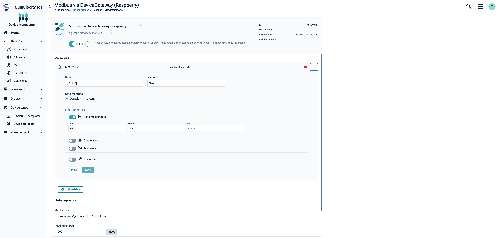

# Testing the setup E2E with OPC-UA

## Introduction

This short guide will show how we can test the complete setup without the need of any additional hardware or device.
We will utilize the Modbus simulator within the Takebishi DeviceGateway to generate data and map it correctly to Cumulocity IoT.
This guide will not go through all the details of the OPC-UA features in Cumulocity IoT. For that please check the official documentation under https://cumulocity.com/docs/protocol-integration/opcua/.

## Setting up the Modbus simulator

In the Takebishi DeviceGateway GUI got to ```Data Source```, click the big plus button, find the ```MODBUS Ethernet``` adapter, give it a name and confim.

Afterwards we can enter the configuration of the adapter by clicking the smal cog wheel.

Under the configuration menu find the ```Simulation``` entry and change it from None to the type of simulation we want (we will use sinus for now).


Afterwards go to the ```Tag``` entry.

For this example we will only create a single entry, but feel free to create as many as we want.

Click the green plus icon in the top right, select tag and give it a name. By default it will be created as holding register and gets the address 1 which is fine for the purpose of this example.


In the end do not forget to start the adapter by pressing the play button.

This is all that needs to be setup inside the Takebishi DeviceGateway as the integration into the OPC-UA server happens automatically.

## Creating the OPC-UA mapping

After the change in the Takebishi DeviceGateway the OPC-UA integration will resync the address space eventually (we can also just restart the docker compose if we don't want to wait).

In Cumulocity IoT in the address space view of the server we should now find our added data source and the tag that we added.


In order to activate the mapping we can create a new protocol in Cumulocity IoT. For that go in the main navigation to Device Types->Device Protocols click "Add device procotol" and select "OPC UA". We can then select our OPC-UA server as the reference server for this protocol.


When we edit the protocol, we can click "Add varibale" to create a new mapping from an OPC-UA node to Cumulocity IoT data. Here we just find the node we want to map in the dropdown under "Path". Then we activate the measurement functionality and give our measurement a name.

Finally in the "Data reporting" section we activate "Cyclic read" and configure an interval of 1000ms.

Once everything is configured we activate the protocol at the top



After a short time a new device should appear in Cumulocity IoT. The name will start with the name of the protocol we configured. The measurements will now appear in the interval we configured for the cyclic read.